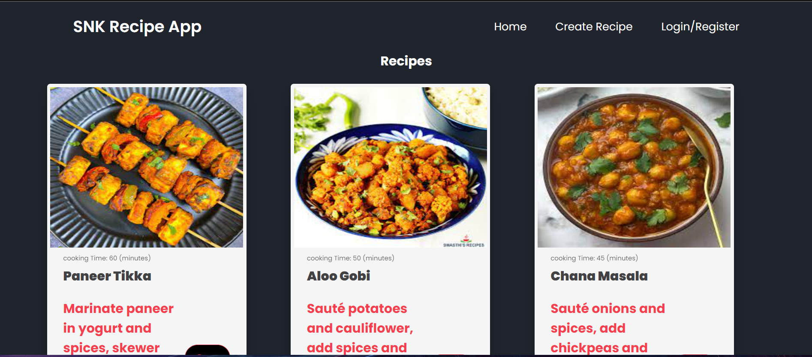

# MERN Recipe App

## About
This project is a MERN (MongoDB, Express, React, Node.js) stack-based recipe website. It provides a secure platform for users to explore and share recipes. The application enables user authentication using JWT (JSON Web Tokens) and bcrypt, ensuring a safe login and registration process. Additionally, users can create new recipes and save their favorites for future reference.

## Features
- Built with MongoDB, Express, React, and Node.js (MERN stack).
- User authentication system using JWT and bcrypt for enhanced security.
- Allows users to create new recipes and save their favorite recipes.
- Provides a user-friendly interface for seamless recipe exploration and management.

## How to Use
1. Clone the repository.
2. Navigate to the project directory.
3. Install dependencies using `npm install`.
4. Start the server using `npm start`.
5. Access the application through your web browser.
6. Register or log in to start exploring recipes and utilizing the application's features.

## Technologies Used
- MongoDB
- Express
- React
- Node.js
- JWT (JSON Web Tokens)
- bcrypt

## Contributors
- [Shriniket Kulkarni](https://github.com/Shriniket007)

## License
This project is licensed under the [MIT License](LICENSE).
